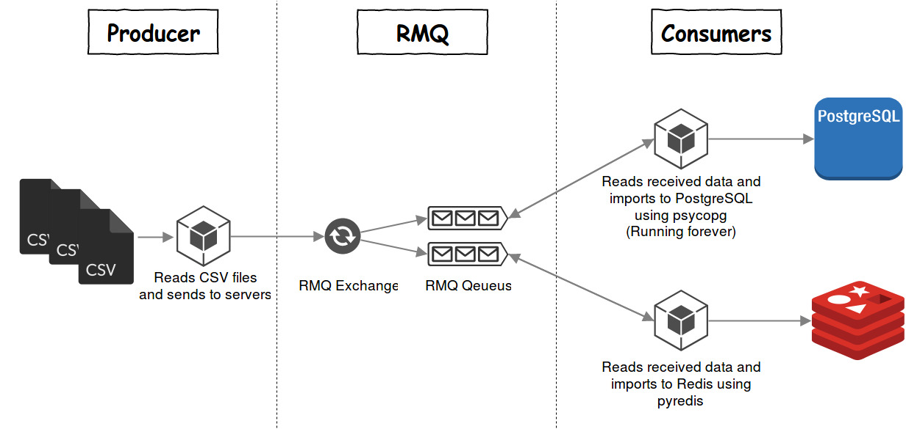

# RabbitMQ Queue Importer 

## Overview

The main idea is to send CSV data (or the CSV itself, this will be discussed later) to other sources in order to import the data into databases. For now we are going to have PostgreSQL and Redis. 

The client will continuously send the CSV data to RMQ's specified queue's which every service has it's own separated queue. The data will remain in the RMQ section until servers fetch it. After fetching, the server will send `ack` packet to RMQ asking to clear the queue.



## Requirements

RabbitMQ service should be installed on master server, then the script will connect to it via `pika` python module. 

`pip3 install pika`

## Configuration

We need to enable listening on all interfaces:

`{tcp_listeners, [{"0.0.0.0", 5672}, {"::1", 5672}]},`

Allow guest remote access:

`{loopback_users, []},`

Currently we don't need `hearbeat` functionality in RMQ so disable it:

`{heartbeat, 0} `

Finally restart the service:

`service rabbitmq restart`

# Redis

For the Redis, it's better to disable disk writing in `redis.conf` file.

Comment the following options:

```
# save 900 1
# save 300 10
# save 60 10000
```

# Configuration File

| Name                                     | Value                                                        |
| ---------------------------------------- | ------------------------------------------------------------ |
| log_path                                 | Unix path for log file                                       |
| **[Client]** host                        | RabbitMQ's host IP in order to connect the client to         |
| **[Client]** csv_path                    | Where should the client look for the CSV files               |
| **[Client]** queue_dict                  | How many queues are listening with queue timeout in milliseconds |
| **[Client]** sleep_time                  | Number of seconds that the client should wait to send the next CSV file |
| **[Master Server]** rmp_host             | RabbitMQ's host IP                                           |
| **[PostgreSQL Consumer]** pg_queue_name  | PostgreSQL queue name                                        |
| **[PostgreSQL Consumer]** csv_store_path | Unix path for storing CSV files                              |
| **[Redis Consumer]** redis_queue_name    | Redis queue name                                             |
| **[Redis Consumer]** redis_host          | Redis server's IP address                                    |
| **[Redis Consumer]** redis_port          | Redis server's port                                          |
| **[Redis Consumer]** redis_ttl           | Redis expiry TTL in seconds                                  |

